# 프롬프트 관리 프로그램

이 프로그램은 콘솔(터미널) 환경에서 동작하는 파이썬 기반 프롬프트 관리 프로그램입니다. AI 프롬프트를 카테고리별로 등록·조회·검색하고, 즐겨찾기로 관리할 수 있습니다.

(프로그램 실행 중에만 데이터가 메모리에 유지되며, 종료하면 초기화됩니다. 자세한 설계 이유는 아래 "설계·개발 문서" 항목을 참고하세요.)

## 저장소 정보

- GitHub 저장소: https://github.com/17lucky71/prompt-manager
- 브랜치: `main`

## 개발 환경

- Python 3.10 이상 (개발 환경: `Python 3.14.7`)
- Git (개발 환경: `git version 2.55.0.windows.5`)

버전 확인 방법:

```
python --version
git --version
```

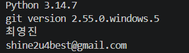

## 실행 방법

```
python prompt_manager.py
```

## 기능 목록

1. 프롬프트 추가
2. 프롬프트 목록
3. 카테고리별 조회
4. 프롬프트 검색
5. 프롬프트 상세 보기
6. 즐겨찾기 관리
7. 즐겨찾기 목록
0. 종료

## 카테고리 목록

- 텍스트 생성
- 이미지 생성
- 영상 생성
- 페르소나
- 자동화
- 기타

## 실행 화면 스크린샷

**메뉴 실행 화면**

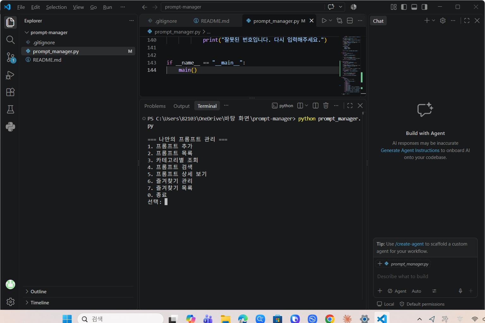

**프롬프트 추가**

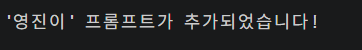

**카테고리별 조회**

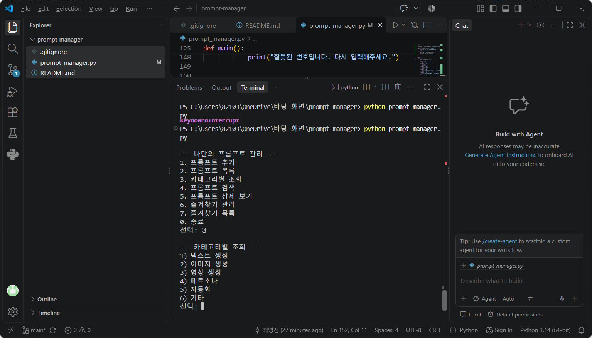
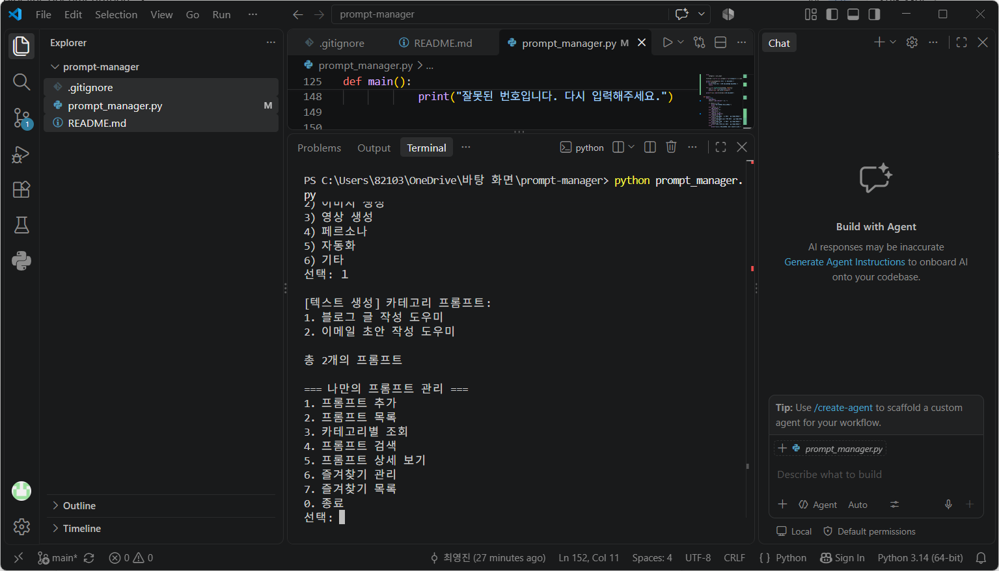

**프롬프트 검색**

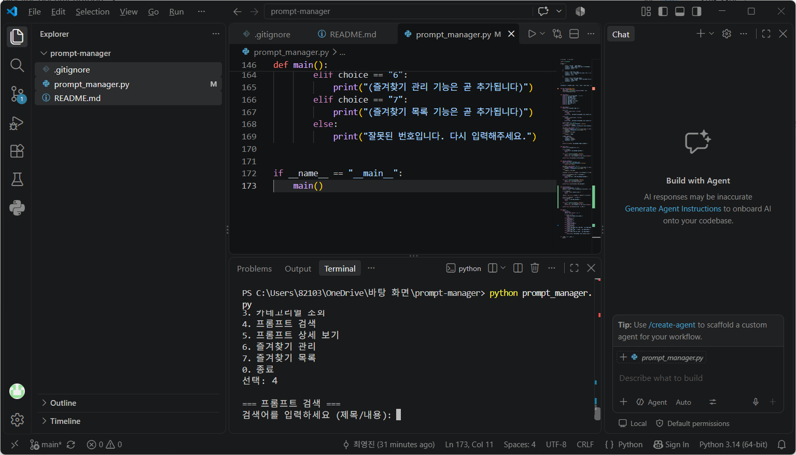
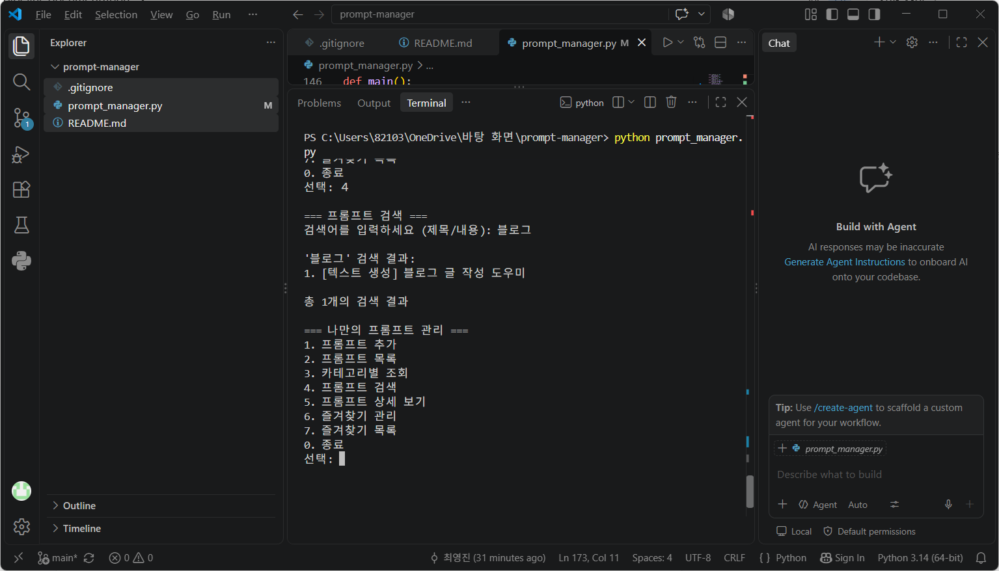

**프롬프트 상세 보기**

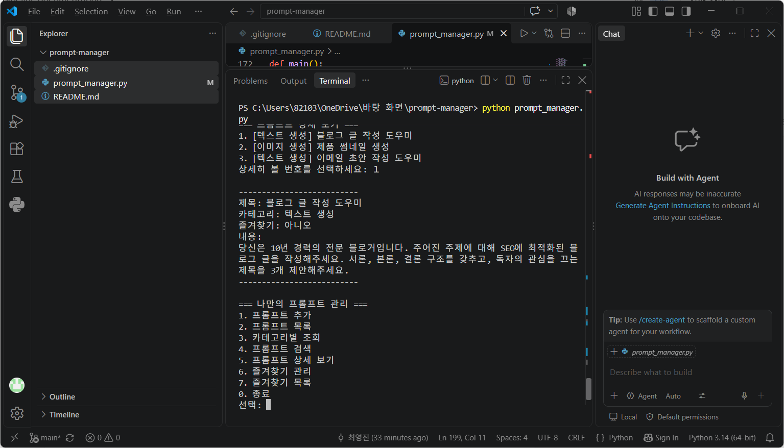

**즐겨찾기 관리**

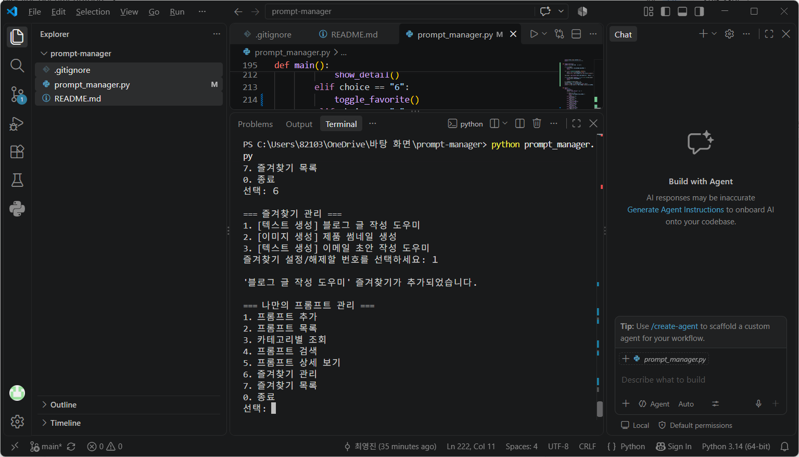
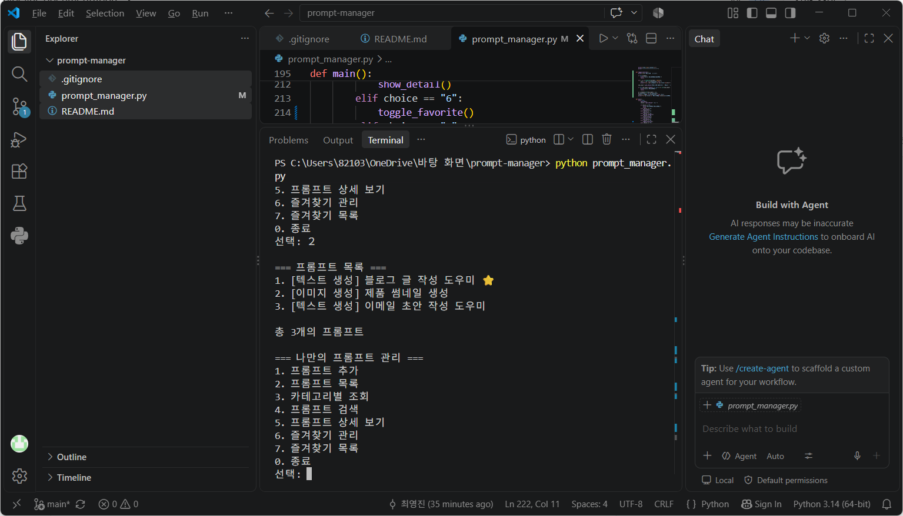
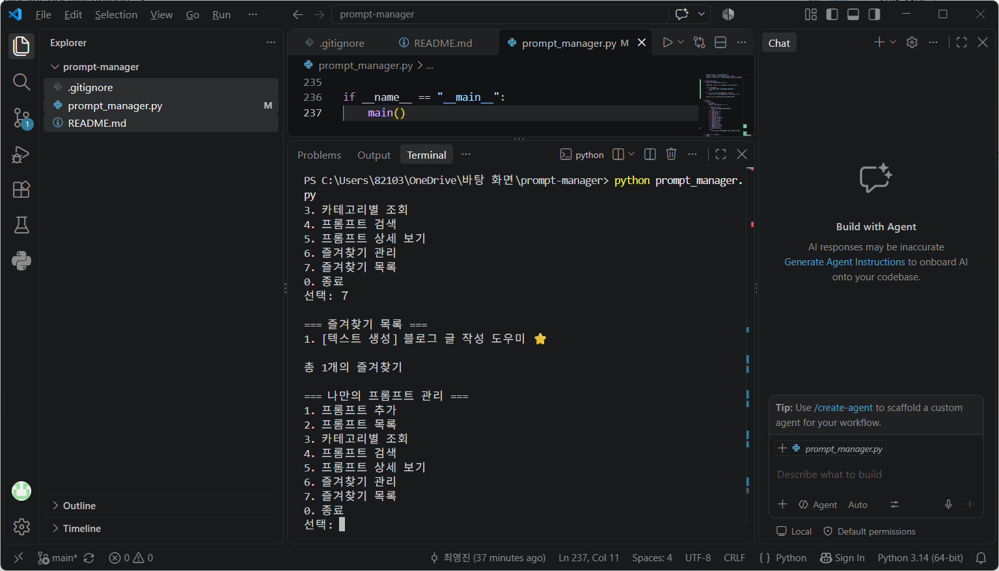

**프로그램 종료**

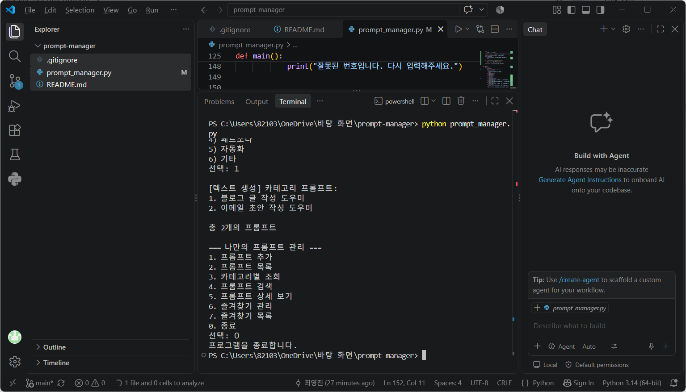

## Git / GitHub 사용 내역 스크린샷

**공개 샘플 저장소 Clone**

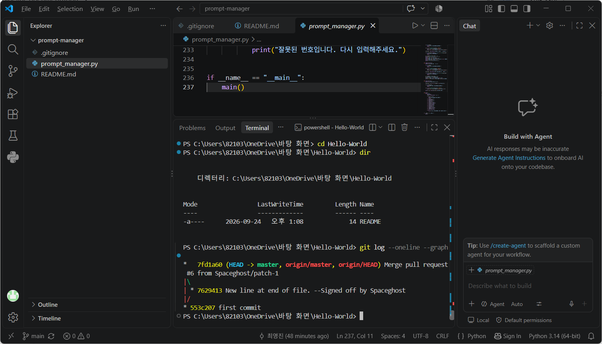

**GitHub 웹에서 직접 수정 후 pull로 반영**

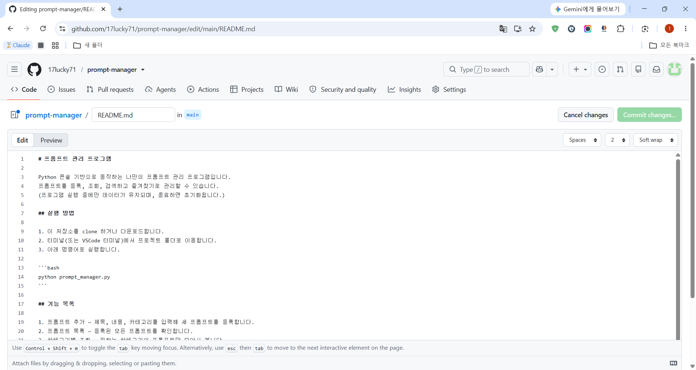
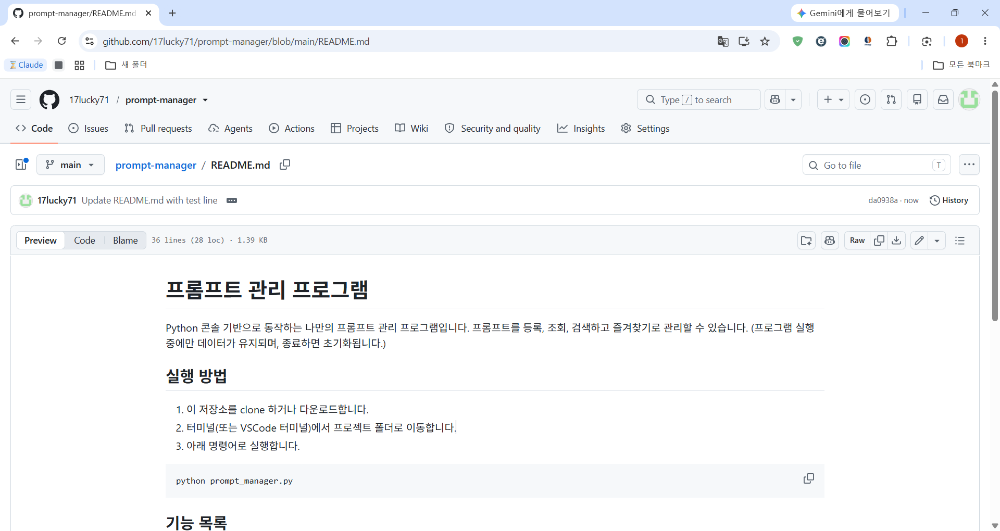
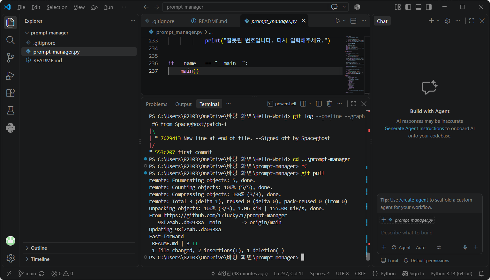

**전체 커밋 이력 (`git log --oneline --graph`) — 브랜치 생성·병합 확인**

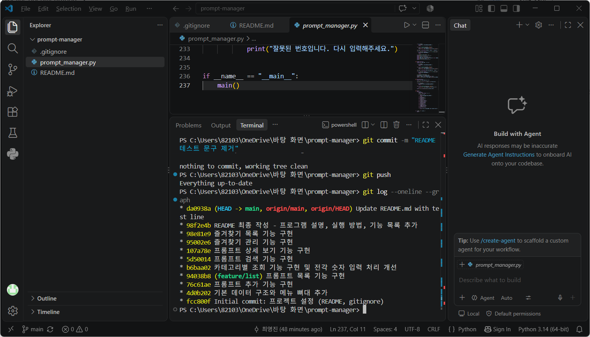

## 설계·개발 문서

프로그램의 함수 구조, 데이터 구조 선택 이유, 입력 검증 로직, 브랜치 전략, Git 사용 내역 등 상세한 설계 근거는 [`개발문서.md`](./개발문서.md) 파일에 정리되어 있습니다.
